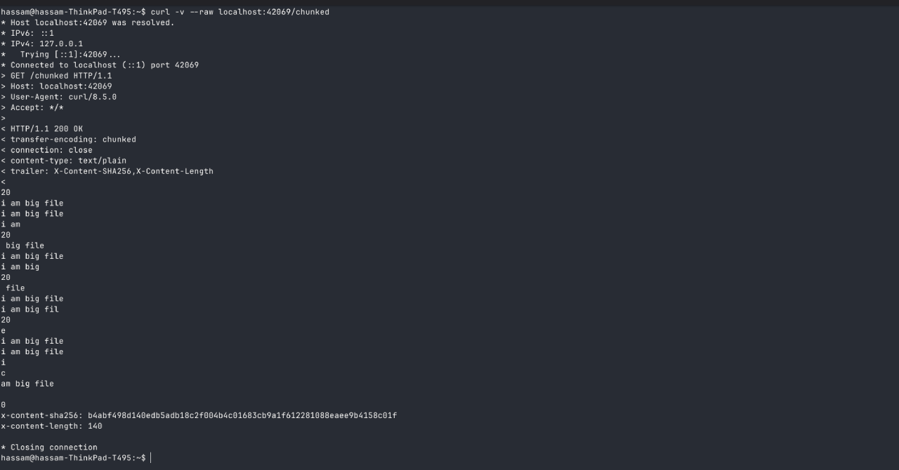
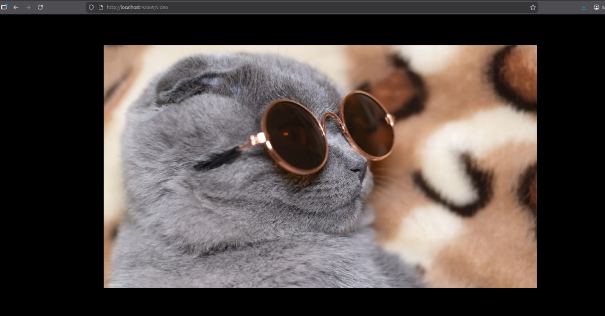
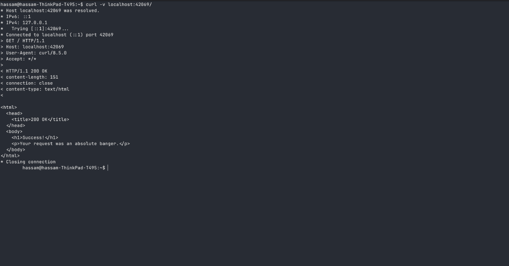
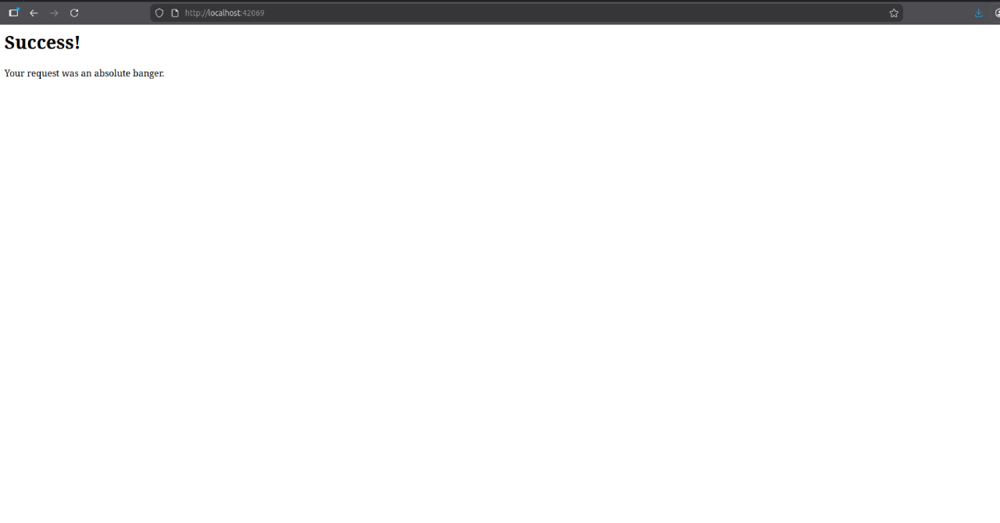

# About Project

 
A functional HTTP/1.1 server from raw TCP sockets in Go without using net/http package. Implemented manual parsing of request line, headers, and body with proper response formatting. Added chunked transfer encoding for big files. 

I built this project because I wanted to strengthened my understanding of TCP socket programming and HTTP protocol internals.

Learning resource : <a href="https://www.boot.dev/lessons/b0cebf37-7151-48db-ad8a-0f9399f94c58">https://www.boot.dev/lessons/b0cebf37-7151-48db-ad8a-0f9399f94c58</a>

## HTTP 1.1 basic implementation
 

### Example of Chunk Encoding for a big file using this server

    
Reading 32 bytes at a time. (32 in hex is Ox20)

    

### Example of Sending binary data on this server

    
Sending a video using header Content-Type: video/mp4

    

### Example of Serving html on this server

    
     
    

